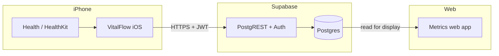

# VitalFlow

## Overview

**VitalFlow** is a personal bridge between **Apple Health** on iPhone and a **metrics web app**: data syncs from the phone (target: **about once per day**), and the site shows an up-to-date history.

**Stack in this repo:** **Supabase** (Postgres + Auth + Row Level Security) + **iOS (SwiftUI + HealthKit)** + **web (Vite + React)**. The site builds to static files and can be hosted on **GitHub Pages**; after sign-in, the browser talks to Supabase over HTTPS.

## Quick start

### Step 1. Supabase project

1. Go to [supabase.com](https://supabase.com) and create a project (the free tier is enough to start).
2. **SQL Editor** → New query → paste the contents of `supabase/migrations/20250404120000_init_health_samples.sql` → **Run** (creates the `health_samples` table and RLS).
3. Run the ECG migration as well: paste `supabase/migrations/20260404230000_ecg_waveforms.sql` → **Run** (creates `ecg_waveforms` for full ECG waveforms from Apple Watch).
4. **Authentication → Providers → Email**: enable email/password. For testing you can temporarily turn off “Confirm email” so you can sign in without email confirmation.
5. **Project Settings → API**: copy the **Project URL** and **anon public** key.

### Step 2. Web dashboard locally

```bash
cd web
cp .env.example .env
# Edit .env: set VITE_SUPABASE_URL and VITE_SUPABASE_ANON_KEY
npm install
npm run dev
```

Open the URL Vite prints in the browser, sign up or sign in — after syncing from iPhone, charts will show data.

### Step 3. GitHub Pages (optional)

1. In the repo: **Settings → Secrets and variables → Actions** — add `VITE_SUPABASE_URL` and `VITE_SUPABASE_ANON_KEY` (same values as in `.env`).
2. **Settings → Pages → Build and deployment → Source: GitHub Actions**.
3. Pushes to `main` run `.github/workflows/deploy-web.yml`. The site is served at `https://<user>.github.io/<repo>/` — the workflow sets `VITE_BASE=/<repo>/` for the build.

### Step 4. iOS app

1. Edit `ios/VitalFlow/VitalFlow/Secrets.swift` — set the same **URL** and **anon** key as in Supabase (use placeholders in git; keep real values local only).
2. Open `ios/VitalFlow/VitalFlow.xcodeproj` in Xcode (see `ios/README.md` for target/source setup if needed).
3. Add the **supabase-swift** package, enable the **HealthKit** capability, and set Health usage descriptions.
4. Build to a **physical iPhone**, sign in with the same email/password, tap **Request access** → **Sync now**.

More detail on metrics (sleep, heart rate, respiratory rate, temperature, ECG) is in `ios/README.md`.

## Problem

- Health data lives in Apple Health, but there is often no convenient **single place in the browser** to see everything together.
- Manual export to spreadsheets is brittle and tedious.
- **Regular sync** is needed without extra daily work.

## Product goals

1. **Read** selected data types from Health on iPhone (via Apple’s platform APIs).
2. **Send** aggregated/filtered records to storage the web app can use.
3. **Refresh** on a schedule (e.g. **once every 24 hours** — exact timing is implementation-specific).
4. **Show** metrics and simple charts over time on the site.

## Apple platform constraints (important)

- **HealthKit** is how an app reads Apple Health on device. Only a **native iOS app** (e.g. Swift/SwiftUI) can use it. A **normal website in Safari cannot** read HealthKit the way an app can.
- So the minimum architecture is: **iOS client (sync)** + **backend/API** + **web UI**.

## Target architecture



- **iOS**: request HealthKit permission, select metric types, background or manual sync within Apple’s rules (background sync has limits; details depend on implementation).
- **Supabase**: accepts rows into `health_samples` (and related tables) from iOS via upsert; the web client reads after sign-in. GitHub Pages only serves **static** frontend assets; the browser connects to Supabase (anon key + user session + RLS).
- **Web**: static frontend (e.g. Vite/React) that calls the API and renders charts/tables.

## Hosting on GitHub

- **GitHub Pages** fits the **frontend** (static files from the repo or from Actions).
- Do **not** commit health data or secrets to a public repo; keep API keys and personal data in CI secrets or env, not in source.

## Free tiers (realistic)

| Component | Typical free option | Caveat |
|-----------|---------------------|--------|
| Repo + Pages | GitHub + GitHub Pages | Traffic/build limits are usually fine for a personal project |
| Backend / DB | Supabase free tier, etc. | Quotas apply; validate under load |
| iOS dev | Xcode, free Apple Developer account | On-device install works with free cert limits |
| App Store | — | **Paid** Apple Developer Program (separate budget, not “$0”) |

For **personal use** on your own iPhone you can skip the App Store; for distribution, budget for Apple Developer.

## MVP scope (draft)

1. **iOS**: read selected HealthKit types, send to backend (auth token stored safely, e.g. Keychain).
2. **Backend + DB** (free tier): accept sync batches, store time-series rows.
3. **Sync schedule**: e.g. once per day (background + fallback when the app opens).
4. **Web**: authenticated view, metrics and basic charts.
5. **Deploy**: GitHub Pages (or Actions → artifact to Pages).

## Beyond MVP

- More metric types, filters, CSV export.
- Push reminders to sync (optional).
- Richer analytics and goals.

## Non-functional expectations

- **Privacy**: minimal data collection; encryption in transit (HTTPS); do not commit raw Health dumps to public git.
- **Clarity**: the site should show what is displayed and for which period.
- **Reliability**: retries so a “once per day” sync is not lost to a flaky network.

## Glossary

| Term | Meaning |
|------|---------|
| HealthKit | Apple API for reading Health data from an iOS app |
| Sync | Uploading collected records to cloud storage for the web app |
| Metric | One measure or aggregate over a period (as defined in the app) |

## Repo status

This repo includes: Supabase SQL migrations, the web app under `web/`, iOS app under `ios/VitalFlow/` (`VitalFlow.xcodeproj` + `VitalFlow/` sources), and a workflow for GitHub Pages. Daily background sync on iOS is a next step.

---

*This document is updated as requirements and tooling evolve.*
